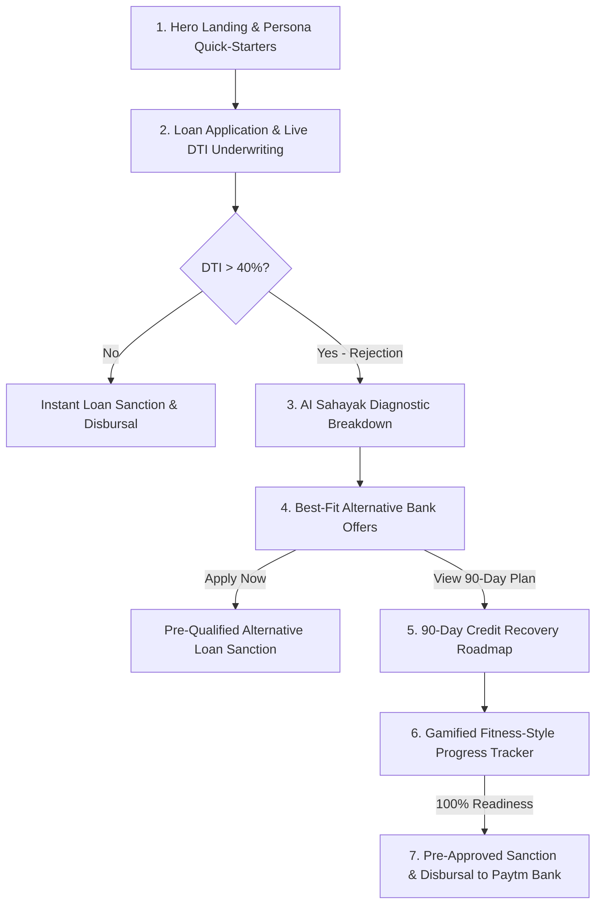

# 🚀 Sahayak — AI Loan Rejection Coach
> **Paytm Build for India AI Hackathon (Track: AI-Powered Financial Journeys)**  
> *Transforming loan rejections into guaranteed 90-day financial recovery and approval pathways.*

---

## 💡 Problem Statement

Traditional banking algorithms in India reject up to **70% of retail and MSME loan applicants** using cold, automated rejection emails. This causes:
- High applicant anxiety and drop-offs.
- Zero clarity on why the rejection occurred (usually Debt-to-Income / BNPL micro-loans).
- Desperate borrowers turning to predatory unregulated lending apps.

---

## 🌟 The Sahayak Solution

**Sahayak** is an empathetic, AI-powered financial coach that turns rejection into the **starting line**. Instead of a dead-end rejection letter, Sahayak provides:

1. **Jargon-Free AI Diagnostics:** Breaks down the exact Debt-to-Income (DTI) math and isolates the real blockers (e.g. 2 small BNPL accounts of ₹6,300/mo causing an automated DTI breach).
2. **Interactive "What-If" Debt Relief Simulator:** Visualizes in real time how paying off small debts immediately flips underwriting eligibility from Red to Green.
3. **Best-Fit Alternative Bank Offers:** Instantly calculates and presents 3 pre-qualified, right-sized loan offers from partner lenders that match the borrower's safe DTI headroom today.
4. **90-Day Actionable Recovery Roadmap:** A structured 3-phase milestone plan aligned with Indian credit bureau (CIBIL/Experian) 30-day reporting cycles.
5. **Gamified Fitness-Style Progress Tracker:** Complete with a circular readiness gauge, discipline streak counters, financial XP levels, and checkable micro-habits.
6. **Pre-Approved Re-Application & Instant Disbursement:** Once the borrower reaches 100% readiness, unlocks a guaranteed loan sanction with 0 hard bureau inquiries, ₹0 processing fee, and simulated 1-click disbursement to Paytm Payments Bank with Paytm Soundbox chime.
7. **Bilingual Support (English & Hinglish):** Authentic Indian fintech experience with a slide-over **Ask Sahayak AI Coach** assistant.

---

## 🛠️ Tech Stack

- **Frontend:** React 19, Vite, Tailwind CSS, Lucide Icons, Canvas Confetti
- **Styling & Design System:** Paytm Cyan-Blue (`#00BAF2`), Deep Navy (`#002970`), Fresh Green (`#00B37E`), Minimalist rounded cards & soft shadows.
- **Data & Underwriting Simulation:** Dynamic client-side DTI calculation engine, preset hackathon personas (Rahul, Priya, Amit), and Account Aggregator surrogates.

---

## 🏃 Quick Start (Local Setup)

```bash
# Clone the repository
git clone https://github.com/<your-username>/sahayak.git

# Navigate to project directory
cd sahayak

# Install dependencies
npm install

# Start development server
npm run dev
```

Open [http://localhost:3000](http://localhost:3000) in your browser.

---

## 📊 End-to-End User Flow



---

## 🏆 Hackathon Demo Personas

- **Rahul Sharma (Gig Delivery Partner):** Income ₹38,000, EMIs ₹21,500 (56.6% DTI) ➔ AI identifies ₹6,300 in 2 BNPLs ➔ 90-day recovery to 34.2% DTI.
- **Priya Verma (Small Boutique Owner):** Income ₹65,000, EMIs ₹34,500 (53.1% DTI) ➔ High revolving card balances ➔ Consolidates debt to 33.8% DTI.
- **Amit Patel (Salaried Software Dev):** Income ₹55,000, EMIs ₹11,000 (20.0% DTI) ➔ Instant loan approval demo.

---

## 📄 License
MIT License. Built for the Paytm Build for India AI Hackathon.
